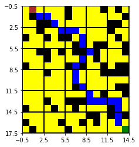

# Path Planning 
This is my solution for this [the problem](https://stackblitz.com/edit/angular-ft5q31?file=src/app/app.component.ts)  which is typical in the context of path planning problems.


## Algorithm 
Since the priority is to find a fast algorithm that finds a path and not necessary a shortest one, a variant of [Rapidly-exploring random](https://en.wikipedia.org/wiki/Rapidly-exploring_random_tree) tree algorithm is is a good candidate. Recall that the main steps of that algorithm are:


### I. Computing a randomly-generated tree with ***Start*** and ***Goal*** are in its vertices.
   1. ** (respec. **) is a tree with one node ***Start*** (respec. ***Goal***). 

   2. P := randomly chosen yellow cell in the grid that is neither  ***Start*** nor ***Goal***.

   3. Using the P, for both ** and ** find two points  **  and ** that are close enough to ** and ** respectively. 

   4. Check wether there exists an "simple path"[<sup>[1]</sup>](#fn1) between ** and **. If so, add that path to   ** , preserving the information about the parents of each node  in both   ** and  **  (the same for ** and **).[<sup>[2]</sup>](#fn2) 

5. If **  and both simple paths exist, return  **.

6. Otherwise, compute a new P and go to Step 3


### II. Finding a path between from ***Start*** to ***Goal***

1. Using the parent information, build ** a path between the last P and ***Start*** (Do the same for ***Goal*** and call it **)
2. Return the concatination of  Rrversed(**) and  **, after removing the duplication of P.

---


<span id="fn1">  [1]   Simple path is a path that is  computed in a fast way.  The algorithm of computing such a path depends on the conditions imposed on the motion. In my codes, I allowed diagonal motion.  </span>

<span id="fn2">  [2]  Recall that Start and Goal are the roots of   *G_start* and *G_goal*  respectively.


## How to use the codes 
we have the following functions *myPathPlanning*,  *plotting*. 

## *myPathPlanning(grid, start,goal,d=4,anim=False)* 

### Input


> **grid**: a 2-dimensional list of lists of the values  ** 

> **start,goal**: two tupes of intefer representing the start and goal

> **d**: variable representing the local search bounds.


> **anim**: if anim is True, then a file movie.gif is generated. This files describes the algorithm using animation.


### Output 
a list of tuples that represent the path from start to goal


## *plotting(grid,start,goal ,path=[])* 
Plots the results from the previous function. 

*grid,start and goal* are as in *myPathPlanning*. *path* is the output of *myPathPlanning*.

## Example

### Computing the path:


```python
from rrt import plotting, myPathPlanning

grid =[[0, 0, 0, 0, 0, 0, 1, 0, 0, 0, 0, 1, 0, 1, 0], 
       [0, 1, 0, 0, 0, 0, 1, 0, 0, 0, 0, 0, 0, 0, 1], 
       [0, 0, 1, 1, 0, 0, 0, 0, 0, 0, 0, 0, 1, 1, 0], 
       [0, 0, 1, 0, 0, 0, 0, 0, 0, 0, 0, 0, 1, 0, 0], 
       [1, 0, 0, 1, 0, 1, 1, 0, 0, 0, 0, 0, 0, 1, 0],
       [0, 0, 0, 0, 0, 0, 0, 1, 0, 0, 1, 1, 0, 0, 1], 
       [0, 0, 1, 1, 0, 1, 0, 1, 1, 0, 1, 0, 0, 0, 1], 
       [0, 0, 0, 1, 0, 0, 0, 0, 0, 0, 1, 0, 0, 0, 0],
       [1, 0, 0, 0, 0, 0, 1, 0, 1, 0, 0, 1, 0, 1, 1], 
       [0, 0, 0, 1, 0, 0, 0, 0, 0, 0, 0, 1, 1, 1, 1],
       [0, 0, 0, 0, 0, 0, 0, 0, 0, 0, 0, 0, 0, 0, 0], 
       [0, 0, 0, 0, 0, 0, 0, 1, 0, 0, 0, 0, 0, 1, 1], 
       [0, 0, 0, 0, 0, 0, 0, 0, 0, 0, 0, 1, 0, 0, 1], 
       [0, 0, 0, 1, 0, 0, 1, 1, 1, 0, 0, 0, 0, 0, 0],
       [1, 0, 0, 0, 1, 0, 0, 1, 0, 0, 0, 0, 1, 0, 0], 
       [0, 0, 0, 0, 0, 0, 0, 0, 0, 1, 1, 0, 1, 0, 1], 
       [1, 0, 0, 0, 0, 1, 0, 0, 1, 0, 1, 0, 0, 0, 0], 
       [0, 1, 0, 0, 0, 0, 1, 0, 0, 0, 0, 0, 0, 0, 0]]


start=[0,1]
goal=[17,14]

path=myPathPlanning(grid, start,goal)

print(path)
```

    [(0, 1), (1, 2), (1, 3), (2, 4), (3, 5), (3, 6), (3, 7), (4, 8), (5, 8), (6, 9), (7, 8), (8, 7), (9, 7), (10, 7), (11, 8), (12, 9), (13, 9), (13, 9), (13, 10), (13, 11), (13, 12), (13, 13), (14, 13), (15, 13), (16, 13), (17, 14)]


### Plotting the path:


```python
plotting(grid,start,goal ,path=path)
```


    

    


## Animating the algorithm (for local use only) 


```python
from google.colab import files
path=myPathPlanning(grid, start,goal,anim=True,diric="imges/")
# This command generates a set of images .... delete them everytime you use it.
```


